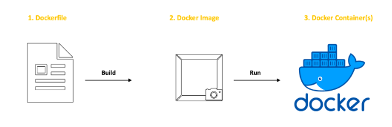

# DevOps Notes
---
> my_apps repository is a small vintage cars app created using html, css and javascript.
> The main aim of this repository  is to learn the devops practices like creating docker images, containers jenkins etc.
# Docker
> A container is a lightweight, standalone, and executable software package that includes everything needed to run a piece of software.
> Unlike VMs which virtualise the hardware, containers virtualise the operating system.
> Docker is simply a tool for creating and managing containers.

>### The key steps involved in using Docker are as follows: 
# 1. Create a Dockerfile
> - A Dockerfile contains the set of instructions for building a Docker Image.
> - A Dockerfile is a recipe that tells Docker how to build your application.

> - It includes instructions like:

> - Start from a base image (e.g., Ubuntu, Node.js).

> - Copy your app files into the container.

> - Install dependencies (e.g., RUN npm install).

> - Set the startup command (e.g., CMD ["npm", "start"]).
# 2. Build the Docker Image
> -A Docker Image serves as a template for creating Docker containers.
> - Run docker build -t my-app .

> - - docker build -t cars_app_image .

> - Docker reads the Dockerfile, downloads dependencies, and creates a ready-to-run package called an image.


# 3. Run the Image as a Container
> - Execute docker run -it --rm -p 8080:80  --name <container-name> my-app
> - - docker run -it --rm -p 8080:80 --name cars_app_container cars_app_image

> - This starts a container (a live instance of the image).

> - The -p 8080:80 flag maps port 8080 on your machine to port 80 in the container.

# 4. Manage Containers
> - View running containers: docker ps

> - Stop a container: docker stop <container-id>

> - Remove a container: docker rm <container-id>

# 5. Share Images (Optional)
> - Upload your image to Docker Hub (like GitHub for Docker images):
> - - docker push my-username/my-app
> - Others can download and run it with:
> - - docker pull my-username/my-app

> ### Troubleshooting inside docker desktop cmd when running container
> - docker exec -it cars_app_container sh
> - cd /usr/share/nginx/html   or  cd /usr/share/nginx/html/resources
> - ls -l
***
# 
# Docker Compose Tutorial: Orchestrating Multi-Container Applications
>  With Compose, you use a YAML file to configure your application's services, networks, and volumes. Then, with a single command, you can create and start all the services from your configuration.

> Instead of manually starting each container with docker run, you define everything in one file.
> - Create docker-compose.yml
> - - Define every service inside thr docker-compose.yaml like web, dickertfile, dbms, volume etc
> - our project directory structure should now look like this:

my-docker-app/
├── docker-compose.yml
├── Dockerfile
└── index.html

> - Start Your Application
> - - docker compose up
> - Detached Mode
> - - docker compose up -d
> -  Stop and Remove Services
> - - docker compose down
>-  For logs
>- - docker compose logs


***
# Automate the processes with bash
> run.sh
``` 
echo "starting nginx with docker compose"
docker-compose up -d

echo "watinng for the container to start"
sleep 2

echo "Open in the browser"
sleep 2

docker-compose down

```# my-project
